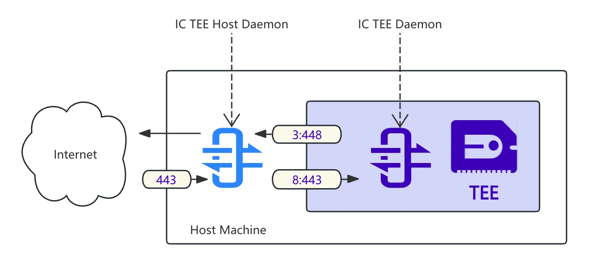

# IC TEE Daemon

`ic_tee_daemon` is a daemon running in enclave, providing the following functions:

1. Forwards requests in enclave to the host.
2. Listens for requests from the host.



## Usage

```bash
ic_tee_daemon --outbound-vsock-addr 3:448 --outbound_listen_addr 127.0.0.1:448 --inbound-vsock-addr 8:443 --inbound-listen-addr 127.0.0.1:8443
```

## License
Copyright © 2024-2025 [LDC Labs](https://github.com/ldclabs).

`ldclabs/ic-tee` is licensed under the MIT License. See [LICENSE](../../LICENSE-MIT) for the full license text.