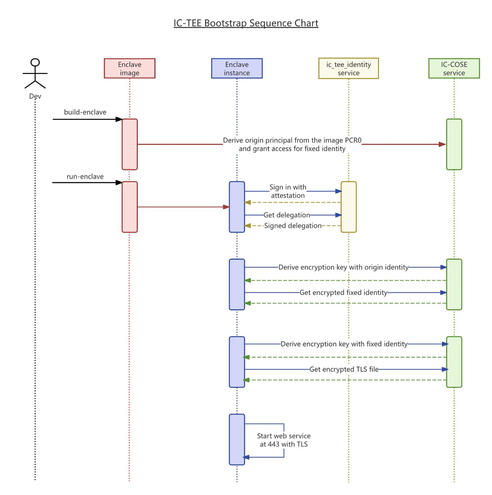
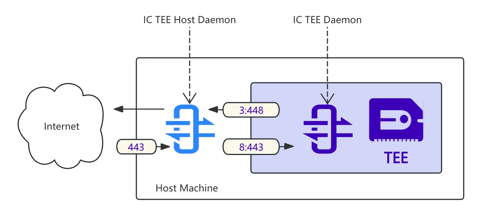

# `ic_tee_nitro_gateway`
## Overview

`ic_tee_nitro_gateway` is a gateway service within an AWS Nitro enclave. It is launched inside the enclave through the ICP `ic_tee_identity` identity service and the IC-COSE configuration service, then forwards requests to the business application running in the enclave.



The bootstrap process is as follows:

1. **Generate attestation** for sign in, obtaining an identity via the ICP `ic_tee_identity` service to access other services on ICP. `ic_tee_identity` verifies the attestation and derives an identity, generating the same identity for identical enclave images.

2. **Switch to a fixed identity** obtained from the IC-COSE configuration service to avoid identity changes due to application upgrades. This enables consistent operations with a stable identity.

3. **Start the web service** using a TLS certificate obtained with the fixed identity from the IC-COSE configuration service. This web service receives requests and forwards them to the application running inside the enclave.

## Deploy
### Building and running AWS Nitro Enclave image

#### Run `ic_tee_host_daemon` on host machine



`ic_tee_host_daemon` is a daemon running on the host machine of an enclave, providing the following functions:

1. Forwards requests from the enclave to the internet.
2. Listens for requests from the internet and forwards them to the enclave.
3. Receives logs from the enclave and outputs them to stdout.

```bash
sudo nohup ./ic_tee_host_daemon > tee.log 2>&1 &
```

It may be necessary to clear the iptables rules.
```bash
iptables -F
iptables -t nat -F
```

Detail: https://github.com/ldclabs/ic-tee-host-daemon

#### Build and run enclave

The following steps should be run in AWS Nitro-based instances.

https://docs.aws.amazon.com/enclaves/latest/user/getting-started.html

Build the enclave image.
```bash
sudo docker pull ghcr.io/ldclabs/ic_tee_nitro_gateway_enclave_amd64:latest
sudo nitro-cli build-enclave --docker-uri ghcr.io/ldclabs/ic_tee_nitro_gateway_enclave_amd64:latest --output-file ic_tee_nitro_gateway_enclave_amd64.eif
# Start building the Enclave Image...
# Using the locally available Docker image...
# Enclave Image successfully created.
# {
#   "Measurements": {
#     "HashAlgorithm": "Sha384 { ... }",
#     "PCR0": "5007e8a48419d8d7117591c6a3dec4e2a99e4cf8776ce492b38a516205e55cfde271964280a9af676f8c3465a6579955",
#     "PCR1": "4b4d5b3661b3efc12920900c80e126e4ce783c522de6c02a2a5bf7af3a2b9327b86776f188e4be1c1c404a129dbda493",
#     "PCR2": "ed2ca28963f4967b791ac8ef5967c8c15075e33fb9bca0904ba1e0b53bd97b0105ac87c89a110ceea7b7a466a54c3841"
#   }
# }
```

Derive the ICP principal from the PCR0.
```bash
cargo install ic_tee_cli
ic_tee_cli -c e7tgb-6aaaa-aaaap-akqfa-cai identity-derive --seed 5007e8a48419d8d7117591c6a3dec4e2a99e4cf8776ce492b38a516205e55cfde271964280a9af676f8c3465a6579955
# principal: fqq6k-lqgif-epz3k-ob4gn-gb2ka-f2hrg-lhhet-lmxk5-yy62z-qkloq-2qe
```

Add the principal to the permament identity setting on IC-COSE service, so that the enclave can load permament identity after sign in with the principal.
```bash
dfx canister call ic_cose_canister setting_add_readers '(record {
  ns = "_";
  key = blob "\69\64\5f\65\64\32\35\35\31\39";
  subject = opt principal "fbi6t-ogdrt-s4de4-sxive-x4yid-xfrk2-e6jgf-jbnuh-rzxoj-qv2qa-zae";
  version = 1;
  user_owned = false;
}, vec{ principal "fqq6k-lqgif-epz3k-ob4gn-gb2ka-f2hrg-lhhet-lmxk5-yy62z-qkloq-2qe" })' --ic
```

Run the enclave.
```bash
sudo nitro-cli run-enclave --cpu-count 2 --memory 512 --enclave-cid 8 --eif-path ic_tee_nitro_gateway_enclave_amd64.eif
# Start allocating memory...
# Started enclave with enclave-cid: 88, memory: 512 MiB, cpu-ids: [1, 3]
# {
#   "EnclaveName": "ic_tee_nitro_gateway_enclave_amd64",
#   "EnclaveID": "i-056e1ab9a31cd77a0-enc19306ae0f2d054b",
#   "ProcessID": 18178,
#   "EnclaveCID": 8,
#   "NumberOfCPUs": 2,
#   "CPUIDs": [
#     1,
#     3
#   ],
#   "MemoryMiB": 512
# }
```

Stop the enclave.
```bash
sudo nitro-cli describe-enclaves
sudo nitro-cli terminate-enclave --enclave-id i-056e1ab9a31cd77a0-enc19306ae0f2d054b
```

## License
Copyright © 2024-2025 [LDC Labs](https://github.com/ldclabs).

`ldclabs/ic-tee` is licensed under the MIT License. See [LICENSE](../../LICENSE-MIT) for the full license text.